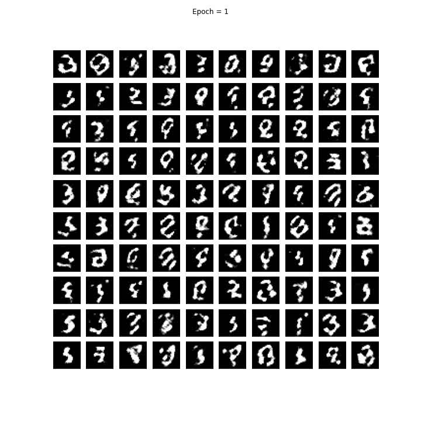
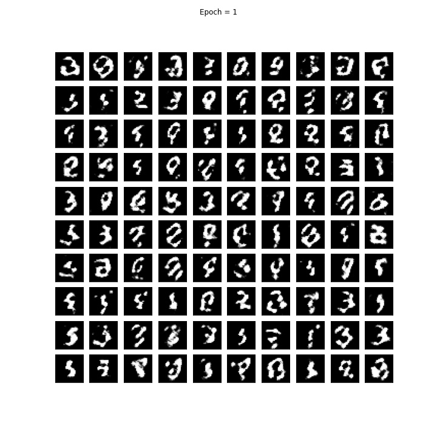
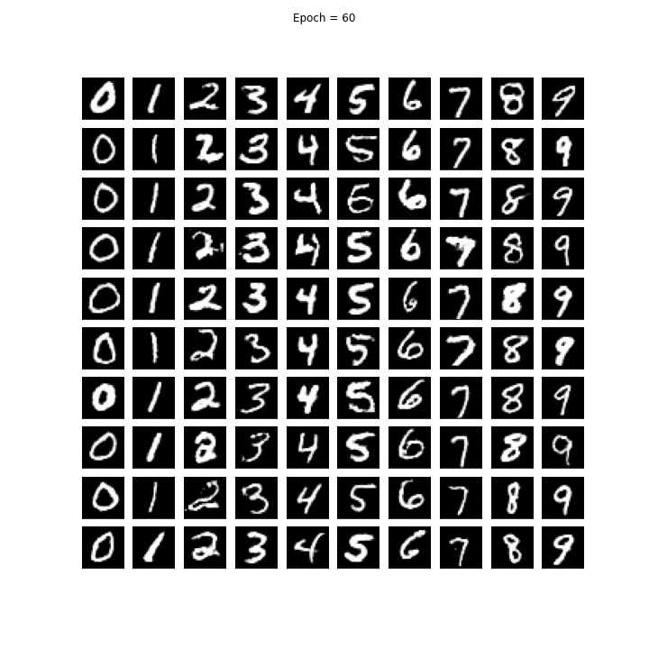

# Advanced Machine Learning Laboratory

  

 <i> Quá trình huấn luyện CGAN trên tập MNIST </i> 

<table border="0" align="center">
  <tr>
    <td>  </td>
    <td>  </td>
  </tr>
</table>

 <i> Ảnh tạo bởi CGAN tại epoch đầu tiên (trái) và tại epoch cuối cùng (phải) </i> 

Bài tập thực hành môn Máy học nâng cao HK1 21-22  
Nội dung các bài tập Lab: 
<ul>
  <li> <b> Lab 01: </b> Introduction to Tensorflow and Keras. Warm-up laboratory </li>
  <li> <b> Lab 02: </b> Implement model checkpoint and select suitable model </li>
  <li> <b> Lab 03: </b> Customize layers in Tensorflow </li>
  <li> <b> Lab 04: </b> Implement ResNet-50 </li>
  <li> <b> Lab 05: </b> LSTM and GRU </li>
  <li> <b> Lab 06: </b> Convolution 1D and Embedding layer </li>
  <li> <b> Lab 07: </b> Deep Convolutional GAN (DCGAN) </li>
  <li> <b> Lab 08: </b> Conditional GAN (CGAN) </li>
  <li> <b> Lab 09: </b> Reinforcement learning: Q-learning </li>
</ul>
